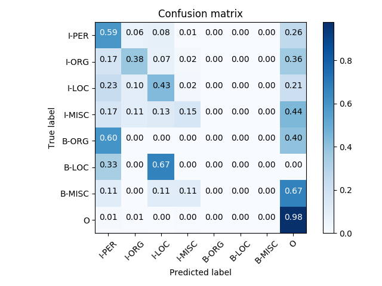

# Table of Contents
- [Blog Post \#1](#blog-post-1)
- [Blog Post \#2](#blog-post-2)
- [Blog Post \#3: Project Proposal](#blog-post-3-project-proposal)
- [Blog Post \#4: Spinning Up](#blog-post-4-spinning-up)
- [Blog Post \#5: BERT Baseline and Error Analysis](#blog-post-5-bert-baseline-and-error-analysis)
- [Blog Post \#6: Augmenting Contextual Word Representations with Entity-Tracking Scaffolds](#blog-post-6-augmenting-contextual-word-representations-with-entity-tracking-scaffolds)
- [Blog Post \#7: Simple Fine-tuning Results](#blog-post-7-simple-fine-tuning-results)
- [Blog Post \#8: Fixed Fine-tuning Results and Generality Metrics](#blog-post-8-fixed-fine-tuning-results-and-generality-metrics)
- [Blog Post \#9: BERT Domain Adaptation via Fine-tuning](#blog-post-9-bert-domain-adaptation-via-fine-tuning)

## Blog Post 1

Our team, BallmerNLP, is comprised of Nelson Liu, Mathew Luo, and Deric Pang.
Our capstone will be hosted at
[https://github.com/dericp/uw-nlp-capstone](https://github.com/dericp/uw-nlp-capstone).

There are three potential projects we are excited about.

### Alternative ELMo Training Objective

The ELMo training objective is to predict the next word given the history.
However, it's not obvious that this training objective will result in a rich
representation of the input text.  We are curious how ELMo embeddings will
change if we modify the objective to jointly predict the next N words given the
history.  Intuitively, this will force the model to learn a high-level
representation of the input that can recover more than just the next word.

Modifying the current ELMo architecture to jointly predict the next N words
should be rather straightforward. It will be tricky to perform fine-tuning
and run experiments to understand what this modified objective accomplishes.
In the best case, we will discover that modifying the ELMo training objective
to predict more words in the future improves the representations generated by
ELMo and results in performance gains on downstream tasks.

### Are Parsers Overfit to PTB?

The Penn Treebank (PTB) was first developed in 1993. Since then, it has become
_the_ standard dataset to train and evaluate parsers in English. Unfortunately,
this means that the same train, dev, and test splits have been used for many
years. We hypothesize that modern parsers may be overfitting to the PTB test
set, and we want to test this by annotating a new test set of comparable size.

Following the original PTB annotation guidelines will be extremely challenging.
It will take weeks just to read and understand the guidelines, and even more
time to become proficient in creating parse trees.  We will likely have to work
with a linguist to verify the quality of our parse trees. In the best case, we
will create a new high-quality PTB test set that will allow us to verify
whether modern parsers have overfit to PTB.

### Biasing models with Human Attention

For this task, we will first obtain datasets with annotated human attention. We
will then extend existing models to take human attention as input and use them
to bias the model. For example, Barret et. al.  regularize neural attention
with human attention.

After we train these models, we will compare them on the same datasets against
models that do not use human attention. We can then analyze the effects of
human attention.  One stretch goal for this project is to show that biasing
models with human attention can consistently improve performance across
different tasks and models.

## Blog Post 2

### Alternative ELMo Training Objective

Pros:
  * Relatively easy to implement.
  * Clear baselines to compare against.
  * Simple but interesting modification to existing techniques.

Cons:
  * Requires significant compute power.
  * Very likely that this will not give interesting results.
  * Beating the performance of BERT will be difficult.

### Biasing Models with Human Attention

Pros:
  * Interesting idea to see how human way of processing text can help NLP
    models.
  * Clear baselines to compare against for the end tasks.

Cons:
  * Corpora annotated with human attention usually are not labelled for NLP and
    vice versa.
  * Hard to tell if the gain is from human attention or multitasking if we deal
    with the last con by multitasking.

### Do PTB Parsers Generalize to the PTB?

Pros:
  * Of great importance to the NLP community (particularly those working on
    syntactic parsing). Past trends in NLP mostly saw datasets being
    constructed and used for (literal) decades---how much have we overfit in
    the interim?
  * Relatively straightforward to conduct the experiment, and the results are
    interesting regardless of the outcome.

Cons:
  * Requires lots of manual labor (manually annotating parse trees), which may
    be a bit boring.
  * It might be hard to run some of the older parsers (especially the
    non-neural ones...)

### Likely Codebases and Platforms

We will do most of our work in AllenNLP and PyTorch.

### Lecture Topic or Class Discussion

It would be fun to have a lecture on the history of the PTB, key design choices
that were made, and a general history of parsers.

## Blog Post \#3: Project Proposal

Contextual word representations (CWRs) like ELMo (Peters et al., 2018), GPT (Radford et al., 2018), and
BERT (Devlin et al., 2019) have improved the state of the art on a wide variety of NLP tasks.
Pretraining large-scale contextualizers on massive amounts of text with
self-supervised objectives (e.g., masked language modeling, bidirectional
language modeling) is key to their success (Liu et al., 2019).

Prior work (Liu et al., 2019) analyzed CWRs with probing models and found notable
shortcomings.  In particular, while CWRs approach or outperform the state of
the art on many tasks, these same embeddings perform poorly on tasks like named
entity recognition (NER).

On one hand, this is fairly expected---knowledge of named entities is unlikely
to significantly aid contextualizers in their pretraining task (be it
bidirectional language modeling, masked language modeling, or some thing else),
so there's little motivation for these models to learn such information.
However, it's also somewhat surprising that linear models on top of large-scale
CWRs are unable to decode such information. In particular, going several
decades to contextual word clusters (e.g., Brown clustering and friends),
person name clustering usually falls out quite neatly, and the same is true of
locations. It seems like these large-scale CWRs should do better with
entities--**in this project, our objective is to examine what are they missing,
and how we devise ways of training CWRs with more information about entities.**

### Minimum Viable Action Plan

We will perform a thorough error analysis of a CWR + linear model NER sequence
labeling model, and compare the output and errors to a CWR + MLP NER seqeuence
labeling model, and the state-of-the-art systems for NER (with and without
pretraining). This analysis would enable us to answer a variety of questions
about the model's behavior and lead to better understanding---for instance,
we're curious whether the errors are distributed across entity types, or
whether it fails to capture one specific type.

We will also devise and experiment with additional probing that stress
information about entity, beyond just named entity recognition and coreference
arc prediction. This would help paint a broader picture of whether (1) CWRs are
not performant at NER or whether (2) CWRs lack information about entities in
general.

### Stretch Goals

We're also interested in producing CWRs with greater knowledge about entities,
and **evaluating whether these methods lead to gains on intrinsic probing tasks
and extrinsic NLP tasks.** For instance, one idea would be to pretrain
entity-aware language models (Ji et al., 2017) and examine whether their hidden states
encode more information about entities / are more performant than standard CWRs
on tasks that require knowledge about entities. It's likely that we will be
able to produce a proof-of-concept, but large-scale pretraining may prove to be
cost and time-prohibitive.

### References

Peters, Matthew E., et al. "Deep contextualized word representations." Proc. of NAACL (2018).

Radford, Alec, et al. ["Improving language understanding by generative pre-training."](https://s3-us-west-2.amazonaws.com/openai-assets/research-covers/language-unsupervised/language_understanding_paper.pdf) (2018).

Devlin, Jacob, et al. "BERT: Pre-training of deep bidirectional transformers for language understanding." Proc. of NAACL (2019).

Liu, Nelson F., et al. "Linguistic Knowledge and Transferability of Contextual Representations." Proc. of NAACL (2019).

Ji, Yangfeng, et al. "Dynamic Entity Representations in Neural Language Models." Proc. of EMNLP (2017).

## Blog Post \#4: Spinning Up

To begin, we wanted to verify that we could reproduce experimental results for
running BERT on the NER task (either individual layers, or a learned weighting
of all layers). To do so, we used the code and infrastructure from [this
repo](https://github.com/nelson-liu/contextual-repr-analysis), and were able to
successfully re-run the experiments and reproduce the results.

We're working on building AllenNLP `Predictor`s to actually produce the
predicted NER tokens for each instance in the development set, and we will
analyze the resultant output files. In particular, we've been looking at
pre-existing tools to facilitate error analysis and draw qualitative and
quantitive conclusions about differences between models from their output. For
example, this recent paper from [Neubig et al.,
(2019)](https://arxiv.org/abs/1903.07926) describes an open-source tool that
seeks to facilitate the comparison of text-generation systems (e.g., for
machine translation).

## Blog Post \#5: BERT Baseline and Error Analysis

We trained and evaluated BERT for NER on the CoNLL 2003 corpus. Our model
scores 0.795 F1 on the dev set and 0.733 F1 on the test set. To understand the
errors made by BERT, we plotted the following confusion matrix.

At the first glance, the model seems really bad at predicting the B tags.
However, since there are only a handful of B tags in our data, these errors
shouldn't affect the overall metrics as much as it seems.

The model seems to classify non-entities well, correctly labeling more than 99%
of the O tags. If we look at I tags, the model also correctly classifies 93% of
people, which is significantly better than 69% of organizations, 81% of
locations, and 68% of miscellaneous. The model seems bad at recognizing both
organizations and miscellaneous entities incorrectly classifies many as
non-entities. Besides non-entities, organizations are most often misclassified
as locations or organizations, while miscellaneous entities are most often
misclassified as organizations or locations.  In general, we can see that the
model is over-classifying things as non-entities which suggests that it is, in
general, having trouble recognizing entities.

From here, we plan on implementing the entity LM (Ji et al., 2017) and training BERT with
additional entity information. We will also perform further error analysis by
comparing the errors of the BERT model the current state-of-the-art NER models.

### References

Ji, Yangfeng, et al. "Dynamic Entity Representations in Neural Language Models." Proc. of EMNLP (2017).

## Blog Post \#6: Augmenting Contextual Word Representations with Entity-Tracking Scaffolds

BERT and ELMo don't seem to encode too much information about entities, and why would they---entities are relatively rare in text, and the ELMo / BERT pretraining objective skews the model toward focusing its capacity on simply learning to reproduce the training data. However, entities are central to language, and the ability to reason about entities is central to language understanding.

Task-specific models and architectures are unlikely to develop this knowledge of entities without stronger inductive biases that encourage them to do so. One way of injecting this inductive bias is through explicitly modeling the phenomena of interest, perhaps with latent variables---the entity NLM model that we previously explored does exactly this. Another popular method for adding a particular inductive bias is multi-task learning. For instance, [Swayamdipta et al. (2018)](https://arxiv.org/abs/1808.10485) demonstrate improved performance on semantic core NLP tasks when multi-tasking with auxiliary syntactic objectives during training. Intuitively, this biases the learned representations toward being performant on both the main training task and the auxiliary scaffold tasks.

Imbuing large-scale contextualizers with stronger notions of entities could take the form of either of the above. Taking representations from a large-scale entity NLM is a far more explicit way of baking in this inductive bias, but it's quite expensive to train (moreso than your typical large language model or other contextualizer). On the other hand, it's possible that fine-tuning on some entity-based scaffold tasks could maintain the quality of the contextual representations while adding greater awareness of entities.

Indeed, a similar idea has been explored by [Hoang et al. (2018)](https://arxiv.org/abs/1810.02891), who augment a model for cloze-style reading comprehension by multitasking on two tasks that require knowledge / tracking of entities. Their first auxiliary task masks out an entity (that has been already referenced in the passage) and forces the reading comprehension model to predict it. This is a remarkably similar setting to the BERT pretraining objective, a point we discuss below (2). Their second auxiliary task has the model predicting, for the entities in a passage, how many times they've been previously mentioned in the passage. The idea here is that, if a model is able to count previous occurrences of an entity, it must have some awareness of them. Adding both of these auxiliary objectives improves over baselines for cloze-style (fill-in-the-blank) reading comprehension.

We're interested in seeing if this idea could similarly translate to improving contextual word representations. More concretely, there are a few possible ways of executing this:

1. Retrain BERT or ELMo with one or more auxiliary entity-tracking objectives.
2. Modify the BERT training objective to mask out more entities, forcing the BERT model to be aware of when entities reoccur in text (the first auxiliary objective proposed by [Hoang et al. (2018)](https://arxiv.org/abs/1810.02891)). Then, retrain BERT.
3. Fine-tune ELMo or BERT on the auxiliary entity-tracking objectives. This is unlikely to work out of the box, since the parameters will most likely become too task-specific and not general enough for applicability to a broad range of tasks. Thus, we'll likely have to fine-tune on auxiliary entity-tracking objectives while also optimizing the LM (in the case of ELMo) or MLM (in the case of BERT) objectives.

(1) and (2) are the most computationally-expensive to execute, but seem more likely to work than (3), since fine-tuning is notoriously finicky. (3) is probably the most feasible to try out in the near future, so we're planning on pushing in this direction. We'll initially start by trying out auxiliary objectives  that are similar in spirit to those proposed in [Hoang et al. (2018)](https://arxiv.org/abs/1810.02891), though we also hope to explore novel objectives (e.g., given two entities, predict whether they corefer or not).

## Blog Post \#7: Simple Fine-tuning Results

While we continue to implement entity-tracking scaffolds, we have fine-tuned
BERT on the CoNLL 2003 corpus. Unsurprisingly, fine-tuning hurts the
performance of the model. Surprisingly, fine-tuning hurts the performance of
the model _a lot_. Without fine-tuning, BERT achieves 0.795 F1 on the dev set.
This drops to 0.402 F1 when we allow the BERT weights to update.

Below is a confusion matrix for this fine-tuned BERT model:

Unfortunately, this confusion matrix is not very informative since there are
so many misclassfications. Across the board we see that the fine-tuned BERT
model makes many more mistakes than the frozen BERT model. This is expected
behavior since it is well known that BERT is difficult to fine-tune.
Also, since we already know that BERT representations do not work
well for NER, it makes sense that fine-tuning these representations does not
improve performance.

Our next actions will be to implement an alternative fine-tuning objective that
is a combination of entity-tracking scaffolds and the LM/MLM objective. We hope
that this alternative object will allow us to fine-tune BERT and improve its
performance on NER.  Unfortunately, we are struggling with finding enough
compute to train our BERT models.  We will need to carefully plan which
experiments we want to run, especially if we want to train ELMo or BERT from
scratch.

### Group Feedback Discussion

We have concluded that while we are working well individually and making good
progress, we should plan more as a team. We will specify deliverables at the
beginning of each week that we hope to complete. Besides the lack of planning,
we are happy with each other and our project.

## Blog Post \#8: Fixed Fine-tuning Results and Generality Metrics

Since the fine-tuning results mentioned in the last blog post was so far off
what is reported in the BERT paper (dev F1 of 0.964 and test F1 of 0.924)
we looked into why our fine-tuning was so ineffective.
We realized that we made some mistakes:

1. We had far too high of a learning rate.
2. Using the BERT learning rate scheduler is important.
3. We only need to tune for a few epochs.

After fixing these
issues, we ran
the fine-tuning again and the model achieved a dev F1 of 0.903 and test F1 of
0.845. Notice that there is still a gap between our results and the ones in the
BERT paper. This can be explained by [the missing details](https://github.com/allenai/allennlp/pull/2067#issuecomment-443961816) in the BERT paper that
they used document context for each word instead of sentence context, which is
not fairly comparable to previous state of the art. Below is the confusion matrix
for our fine-tuned BERT model on the test data:

Now that we have fine-tuned embeddings that performs fairly well on NER and
continue to develop more variants, how do we know if they still maintain the
generality of language representations, or just become too task-specific for NER?
One way to check this is to run our representations on the GLUE benchmark, which
consists of various tasks testing the model's understanding. We can compare the
performance on these tasks against the original BERT to see whether our representations
maintains the generality while it has been optimized for NER.

Specifically, we will:

1. Set up an evaluation pipeline on GLUE to evaluate how general our fine-tuned
BERT embeddings are.
2. Finish implementing the mixed fine-tuning objective and evaluate these
embeddings.

## Blog Post \#9: BERT Domain Adaptation via Fine-tuning

While we continue to implement our multitask objective, we realized that a reasonable point of comparison is simply fine-tuning the BERT model with its original training objective (the mix of masked language modeling and next-sentence prediction) on the raw data we plan to use in our multitask setup.

We were particularly inspired in this regard by Ilya Sutskever's reaction to Rich Sutton's blog post (["The Bitter Lesson"](http://www.incompleteideas.net/IncIdeas/BitterLesson.html)). In his blog post, Sutton argues that models that simply take advantage of more data and more compute are more effective than those that try to be clever in modeling human cognition---the bitter lesson is that more compute and more data always wins. Ilya echoed this sentiment, [noting that "The reason most (not all) methods don't add value (over baseline) when scaled is because they're "extra training data in disguise", so their benefit vanishes in the high data regime"](https://twitter.com/ilyasut/status/1114658175272095744). In this regard, we want to ensure that our multi-task training setup isn't working _simply_ because it's extra training data for BERT in disguise.

As a result, we took an idea from the ULMFiT paper [1] by fine-tuning our BERT model on the CoNLL 2003 raw text using its original training objective (MLM and NSP). This can be thought of as a sort of domain adaptation---we want to rule out the possibility that our multitask models work better because they enabled a BERT-based model to better capture the domain mismatch. After fine-tuning on the CoNLL 2003 rawtext, we trained models to do NER on CoNLL 2003 in the two ways previously explored---simply adding a linear layer on top of BERT embeddings, and varying whether or not to update the BERT parameters during training (fine-tuning vs frozen contextual word representations).

Surprisingly, training a model on top of frozen contextual word representations from the domain-adapted BERT model led to significant NER performance reductions. The model as only able to achieve a validation F1 of `63.33` and a test F1 of `57.97`. For comparison, without fine-tuning, we were able to get `79.5` F1 on the dev set and `73.3` F1 on the test set when training a linear layer on top of frozen contextual word representations from the normal `bert-base-cased`. It's surprising that this domain adaptation step has such an adverse effect when using features from contextual word representations, and we'll continue to think about why we see this result.

On the other hand, fine-tuning a domain-adapted BERT model on the NER task led to much stronger results. We were able to achieve a validation F1 of `89.68` and a test F1 of `84.01`. While this is a much more respectable performance, it still underperforms a model that doesn't use our domain adaptation step (using the vanilla base cased BERT model yields a dev F1 of `90.3` and test F1 of `84.5`).

[1]: Howard, Jeremy and Sebastian Ruder. "Universal Language Model Fine-tuning for Text Classification." Proc. of ACL (2018).
