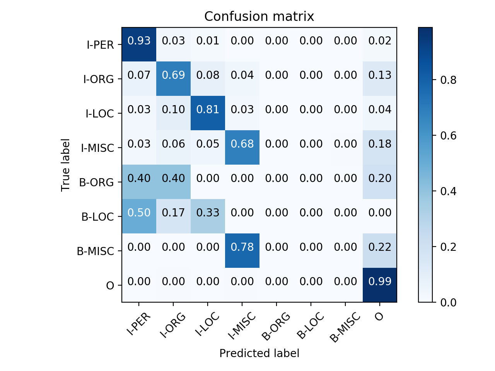

# Table of Contents
- [Blog Post \#1](#blog-post-1)
- [Blog Post \#2](#blog-post-2)
- [Blog Post \#3: Project Proposal](#blog-post-3-project-proposal)
- [Blog Post \#4: Spinning Up](#blog-post-4-spinning-up)

## Blog Post 1

Our team, BallmerNLP, is comprised of Nelson Liu, Mathew Luo, and Deric Pang.
Our capstone will be hosted at
[https://github.com/dericp/uw-nlp-capstone](https://github.com/dericp/uw-nlp-capstone).

There are three potential projects we are excited about.

### Alternative ELMo Training Objective

The ELMo training objective is to predict the next word given the history.
However, it's not obvious that this training objective will result in a rich
representation of the input text.  We are curious how ELMo embeddings will
change if we modify the objective to jointly predict the next N words given the
history.  Intuitively, this will force the model to learn a high-level
representation of the input that can recover more than just the next word.

Modifying the current ELMo architecture to jointly predict the next N words
should be rather straightforward. It will be tricky to perform fine-tuning
and run experiments to understand what this modified objective accomplishes.
In the best case, we will discover that modifying the ELMo training objective
to predict more words in the future improves the representations generated by
ELMo and results in performance gains on downstream tasks.

### Are Parsers Overfit to PTB?

The Penn Treebank (PTB) was first developed in 1993. Since then, it has become
_the_ standard dataset to train and evaluate parsers in English. Unfortunately,
this means that the same train, dev, and test splits have been used for many
years. We hypothesize that modern parsers may be overfitting to the PTB test
set, and we want to test this by annotating a new test set of comparable size.

Following the original PTB annotation guidelines will be extremely challenging.
It will take weeks just to read and understand the guidelines, and even more
time to become proficient in creating parse trees.  We will likely have to work
with a linguist to verify the quality of our parse trees. In the best case, we
will create a new high-quality PTB test set that will allow us to verify
whether modern parsers have overfit to PTB.

### Biasing models with Human Attention

For this task, we will first obtain datasets with annotated human attention. We
will then extend existing models to take human attention as input and use them
to bias the model. For example, Barret et. al.  regularize neural attention
with human attention.

After we train these models, we will compare them on the same datasets against
models that do not use human attention. We can then analyze the effects of
human attention.  One stretch goal for this project is to show that biasing
models with human attention can consistently improve performance across
different tasks and models.

## Blog Post 2

### Alternative ELMo Training Objective

Pros:
  * Relatively easy to implement.
  * Clear baselines to compare against.
  * Simple but interesting modification to existing techniques.

Cons:
  * Requires significant compute power.
  * Very likely that this will not give interesting results.
  * Beating the performance of BERT will be difficult.

### Biasing Models with Human Attention

Pros:
  * Interesting idea to see how human way of processing text can help NLP
    models.
  * Clear baselines to compare against for the end tasks.

Cons:
  * Corpora annotated with human attention usually are not labelled for NLP and
    vice versa.
  * Hard to tell if the gain is from human attention or multitasking if we deal
    with the last con by multitasking.

### Do PTB Parsers Generalize to the PTB?

Pros:
  * Of great importance to the NLP community (particularly those working on
    syntactic parsing). Past trends in NLP mostly saw datasets being
    constructed and used for (literal) decades---how much have we overfit in
    the interim?
  * Relatively straightforward to conduct the experiment, and the results are
    interesting regardless of the outcome.

Cons:
  * Requires lots of manual labor (manually annotating parse trees), which may
    be a bit boring.
  * It might be hard to run some of the older parsers (especially the
    non-neural ones...)

### Likely Codebases and Platforms

We will do most of our work in AllenNLP and PyTorch.

### Lecture Topic or Class Discussion

It would be fun to have a lecture on the history of the PTB, key design choices
that were made, and a general history of parsers.

## Blog Post \#3: Project Proposal

Contextual word representations (CWRs) like ELMo[^fn1], GPT[^fn2], and
BERT[^fn3] have improved the state of the art on a wide variety of NLP tasks.
Pretraining large-scale contextualizers on massive amounts of text with
self-supervised objectives (e.g., masked language modeling, bidirectional
language modeling) is key to their success.[^fn4]

Prior work[^fn4] analyzed CWRs with probing models and found notable
shortcomings.  In particular, while CWRs approach or outperform the state of
the art on many tasks, these same embeddings perform poorly on tasks like named
entity recognition (NER).

On one hand, this is fairly expected---knowledge of named entities is unlikely
to significantly aid contextualizers in their pretraining task (be it
bidirectional language modeling, masked language modeling, or some thing else),
so there's little motivation for these models to learn such information.
However, it's also somewhat surprising that linear models on top of large-scale
CWRs are unable to decode such information. In particular, going several
decades to contextual word clusters (e.g., Brown clustering and friends),
person name clustering usually falls out quite neatly, and the same is true of
locations. It seems like these large-scale CWRs should do better with
entities--**in this project, our objective is to examine what are they missing,
and how we devise ways of training CWRs with more information about entities.**

### Minimum Viable Action Plan

We will perform a thorough error analysis of a CWR + linear model NER sequence
labeling model, and compare the output and errors to a CWR + MLP NER seqeuence
labeling model, and the state-of-the-art systems for NER (with and without
pretraining). This analysis would enable us to answer a variety of questions
about the model's behavior and lead to better understanding---for instance,
we're curious whether the errors are distributed across entity types, or
whether it fails to capture one specific type.

We will also devise and experiment with additional probing that stress
information about entity, beyond just named entity recognition and coreference
arc prediction. This would help paint a broader picture of whether (1) CWRs are
not performant at NER or whether (2) CWRs lack information about entities in
general.

### Stretch Goals

We're also interested in producing CWRs with greater knowledge about entities,
and **evaluating whether these methods lead to gains on intrinsic probing tasks
and extrinsic NLP tasks.** For instance, one idea would be to pretrain
entity-aware language models[^fn5] and examine whether their hidden states
encode more information about entities / are more performant than standard CWRs
on tasks that require knowledge about entities. It's likely that we will be
able to produce a proof-of-concept, but large-scale pretraining may prove to be
cost and time-prohibitive.

## Blog Post \#4: Spinning Up

To begin, we wanted to verify that we could reproduce experimental results for
running BERT on the NER task (either individual layers, or a learned weighting
of all layers). To do so, we used the code and infrastructure from [this
repo](https://github.com/nelson-liu/contextual-repr-analysis), and were able to
successfully re-run the experiments and reproduce the results.

We're working on building AllenNLP `Predictor`s to actually produce the
predicted NER tokens for each instance in the development set, and we will
analyze the resultant output files. In particular, we've been looking at
pre-existing tools to facilitate error analysis and draw qualitative and
quantitive conclusions about differences between models from their output. For
example, this recent paper from [Neubig et al.,
(2019)](https://arxiv.org/abs/1903.07926) describes an open-source tool that
seeks to facilitate the comparison of text-generation systems (e.g., for
machine translation).

## Blog Post \#5: BERT Baseline and Error analysis

We trained and evaluated BERT for NER on the CoNLL 2003 corpus. Our model
scores 0.795 F! on the dev set and 0.733 on the test set. To understand the
errors made by BERT, we plotted the following confusion matrix.

At the first glance, the model seems really bad at predicting the B tags.
However, since there are only a handful of B tags in our data, these errors
shouldn't affect the overall metrics as much as it seems.

The model seems to classify non-entities well, correctly labeling more than 99%
of the O tags. If we look at I tags, the model also correctly classifies 93% of
people, which is significantly better than 69% of organizations, 81% of
locations, and 68% of miscellaneous. The model seems bad at recognizing both
organizations and miscellaneous entities incorrectly classifies many as
non-entities. Besides non-entities, organizations are most often misclassified
as locations or organizations, while miscellaneous entities are most often
misclassified as organizations or locations.  In general, we can see that the
model is over-classifying things as non-entities which suggests that it is, in
general, having trouble recognizing entities.

From here, we plan on implementing the entity LM[^fn5] and training BERT with
additional entity information. We will also perform further error analysis by
comparing the errors of the BERT model the current state-of-the-art NER models.

## References

[^fn1]: Peters, Matthew E., et al. "Deep contextualized word representations." Proc. of NAACL (2018).

[^fn2]: Radford, Alec, et al. ["Improving language understanding by generative pre-training."](https://s3-us-west-2.amazonaws.com/openai-assets/research-covers/language-unsupervised/language_understanding_paper.pdf) (2018).

[^fn3]: Devlin, Jacob, et al. "BERT: Pre-training of deep bidirectional transformers for language understanding." Proc. of NAACL (2019).

[^fn4]: Liu, Nelson F., et al. "Linguistic Knowledge and Transferability of Contextual Representations." Proc. of NAACL (2019).

[^fn5]: Ji, Yangfeng, et al. "Dynamic Entity Representations in Neural Language Models." Proc. of EMNLP (2017).
